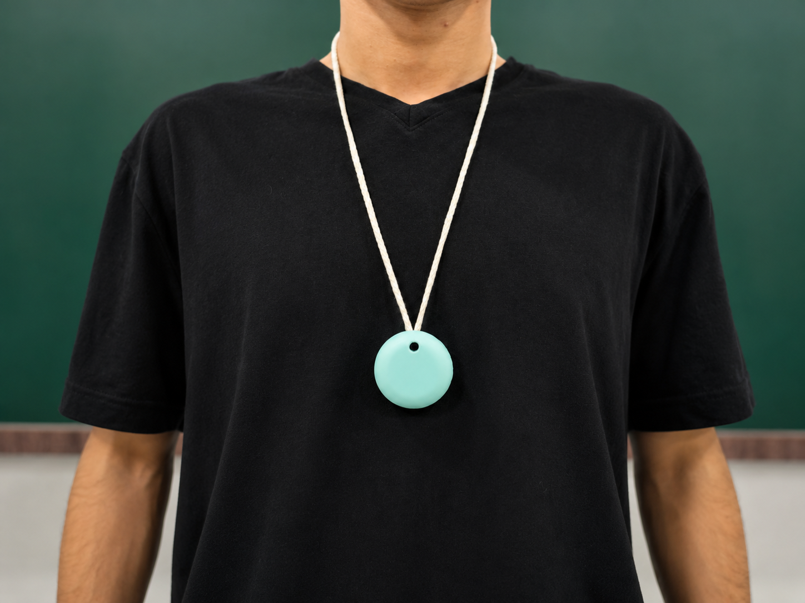
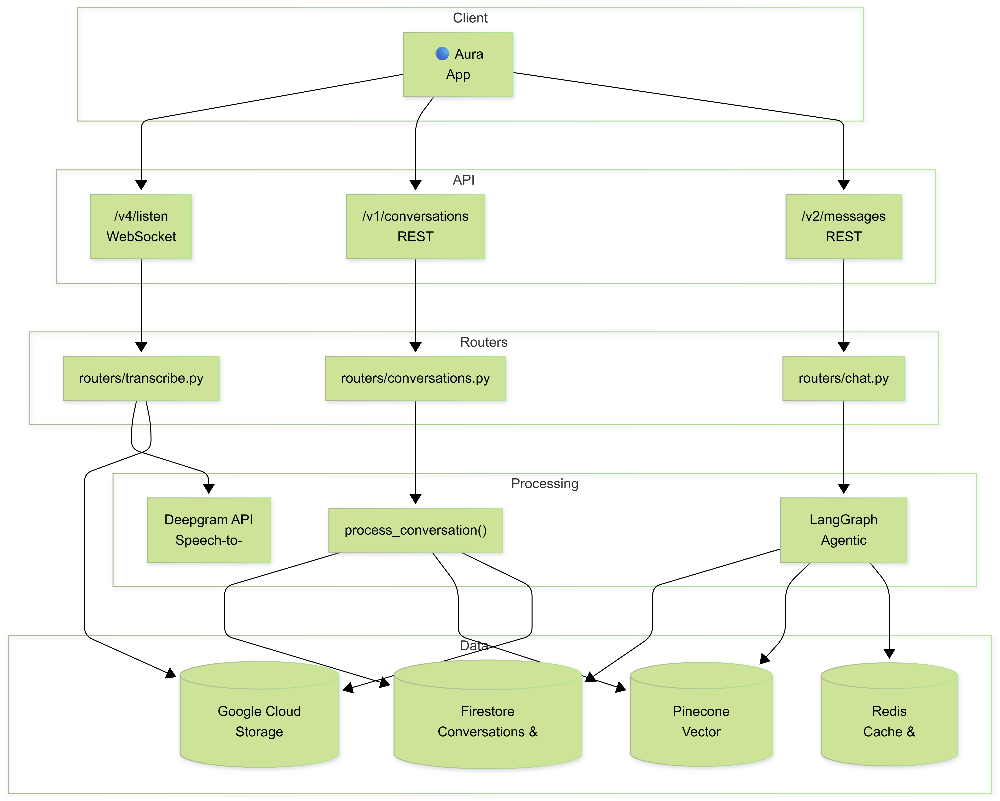
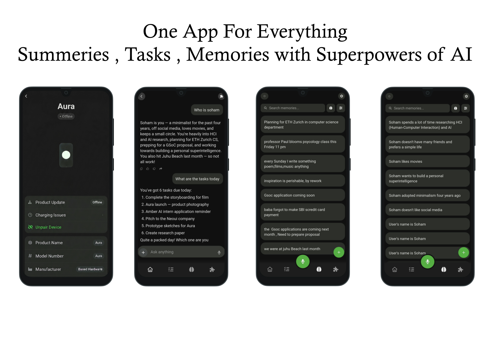
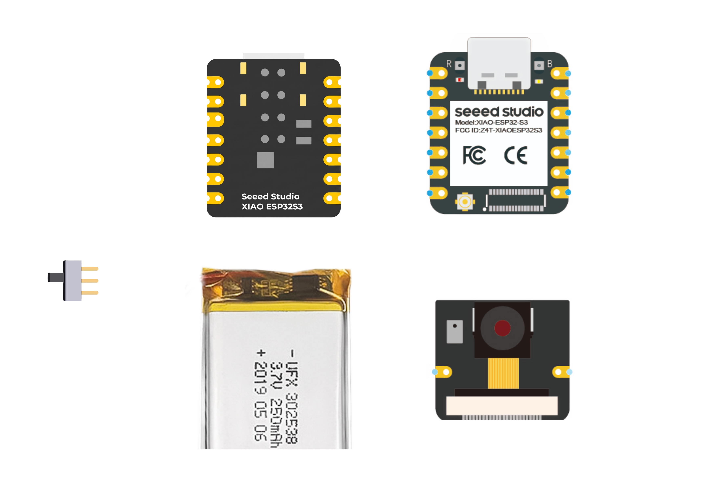

<div align="center">

# AURA

**Open-source AI wearable pendant. Sees it. Hears it. Remembers it.**

<br/>



<br/>

[](LICENSE)
[](https://wiki.seeedstudio.com/xiao_esp32s3_getting_started/)
[](app/android)
[](#bill-of-materials)

</div>

<br/>

---

<br/>

AURA is a wearable AI context engine designed to capture, process, and remember environmental signals in real-time. It streams audio and images from a pendant to your mobile device, where AI models transform the data into a searchable, semantic memory of your life.

### Key Capabilities

- **Continuous Transcription:** Real-time audio processing via Deepgram.
- **Contextual Vision:** Image frame analysis via GPT-4o Vision.
- **Semantic Memory:** Long-term storage and RAG retrieval via Pinecone and Firestore.
- **Agentic Chat:** A natural language interface to interact with your captured memories.

<br/>

---

<br/>

## System Architecture

<div align="center">
  
</div>

<br/>

## Mobile Interface

<div align="center">
  
</div>

<br/>

## Hardware Assembly

<div align="center">
  
</div>

<br/>

---

<br/>

## Bill of Materials

| Component | Spec | Qty | Source |
|:---|:---|:---:|:---|
| **XIAO ESP32-S3 Sense** | MCU + Camera + Mic | 1 | [Seeed Studio](https://www.seeedstudio.com/XIAO-ESP32S3-Sense-p-5639.html) |
| **LiPo Battery 350mAh** | 3.7V single cell | 2 | [Robu.in](https://robu.in/product/wly751535-350mah-3-7v-single-cell-rechargeable-lipo-battery) |
| **Slider Switch** | 4mm SPDT 1P2T | 1 | [Robu.in](https://robu.in/product/4mm-spdt-1p2t-slide-switch-pack-of-10) |
| **Silicon Wire** | 28 AWG flexible | 1 | [Amazon](https://www.amazon.com/s?k=BNTECHGO+28+AWG+silicone+wire) |
| **3D Enclosure** | PLA/PETG (STL) | 1 | [Project Hardware](hardware/) |
| **Necklace Cord** | 2mm Waxed | 1 | [Amazon](https://www.amazon.com/s?k=waxed+cord+necklace+2mm+black) |

<br/>

## Hardware Specs

| Feature | Specification |
|:---|:---|
| **CPU** | Xtensa® Dual-core 32-bit LX7 @ 240MHz |
| **RAM** | 8MB PSRAM + 384KB SRAM |
| **Optics** | OV2640 2MP Camera (1600x1200) |
| **Audio** | Digital PDM Microphone |
| **Wireless** | 2.4GHz WiFi + BLE 5.0 |

<br/>

---

<br/>

## Quick Start

### 1. Firmware
Flash the latest UF2 binary to your XIAO ESP32-S3.
- `Hold BOOT` -> `Reset` -> `Drag and Drop UF2`

### 2. Backend
```bash
cd backend
pip install -r requirements.txt
uvicorn main:app --reload
```

### 3. Mobile App
Open `app/android/` in Android Studio, sync Gradle, and install on your device.

<br/>

---

<br/>

## Documentation Guides

- [Firmware Setup Guide](docs/guides/firmware-setup.md) - Flashing, IDE setup, and drivers.
- [Backend Setup Guide](docs/guides/backend-setup.md) - Firebase, Firestore, and AI keys.
- [Mobile App Setup Guide](docs/guides/app-setup.md) - Android build and pairing.
- [Contributing](CONTRIBUTING.md) - How to help improve AURA.

<br/>

---

<br/>

<div align="center">

**AURA** — Open Hardware · Open Firmware · Open Intelligence

[⭐ Star on GitHub](https://github.com/thesohamdatta/Aura-Wearable-AI) · [Issues](https://github.com/thesohamdatta/Aura-Wearable-AI/issues) · [MIT License](LICENSE)

<br/>


</div>
