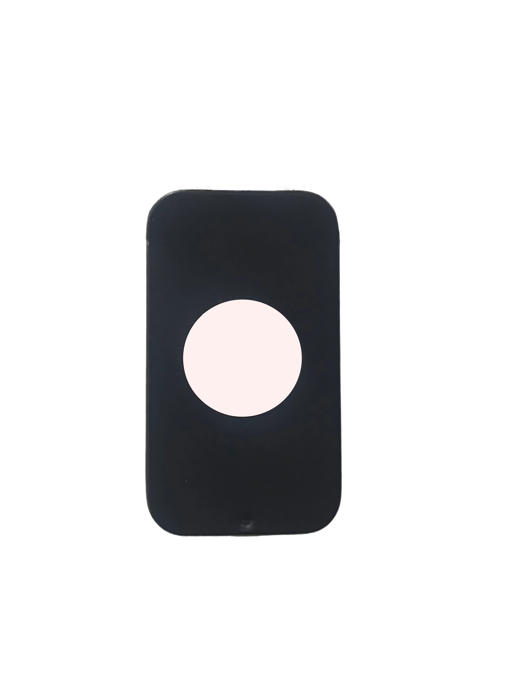
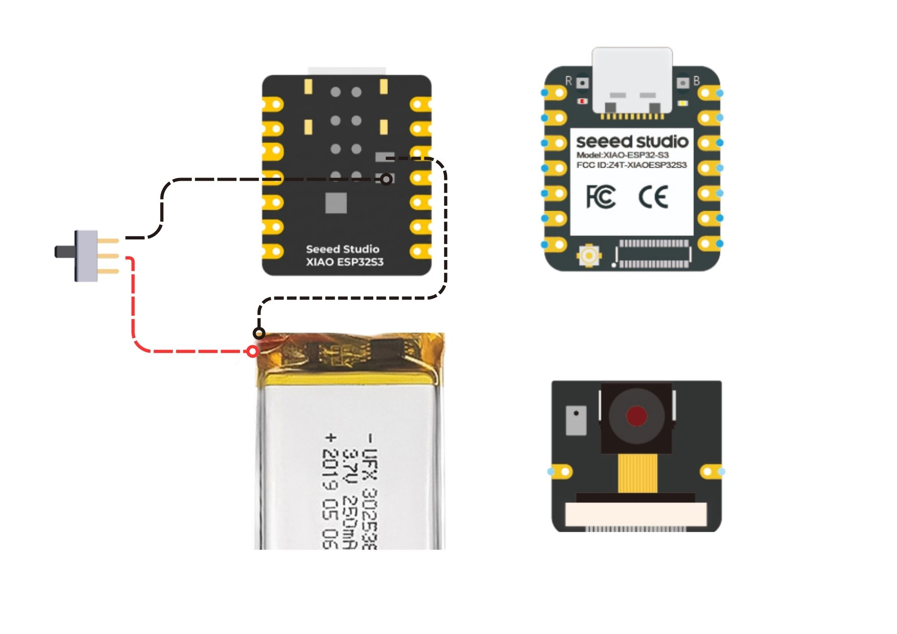
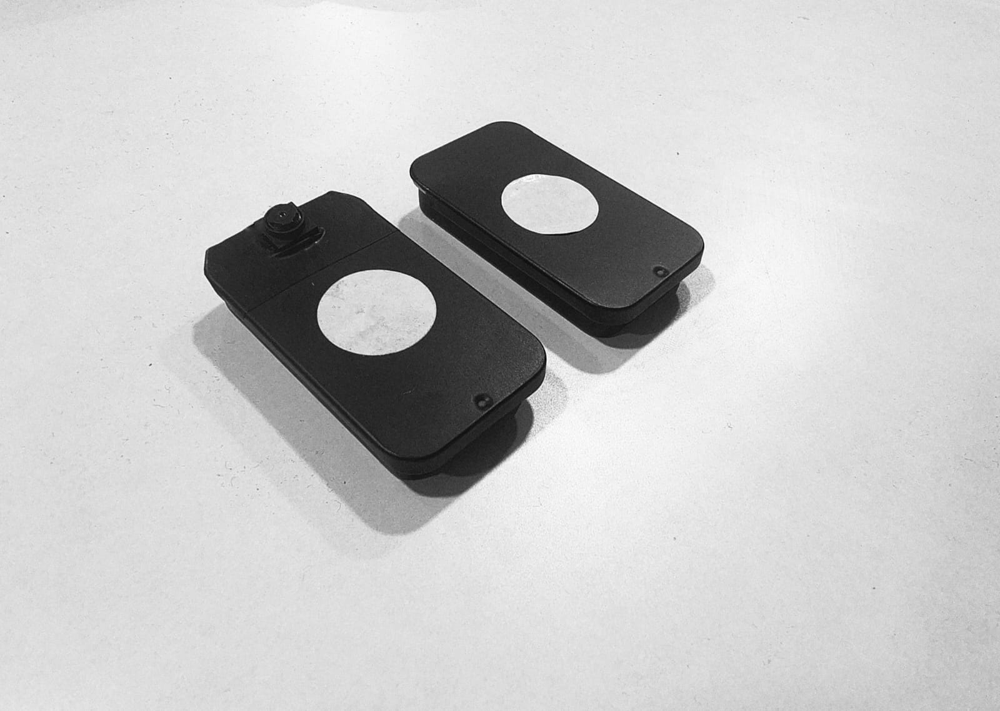
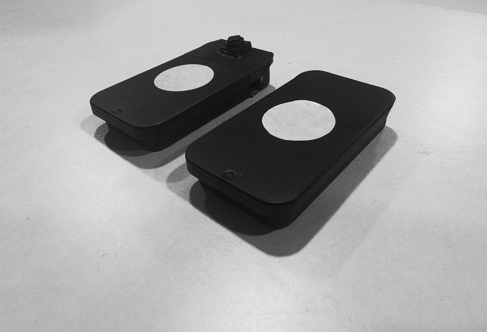

<div align="center">

<h1><b>AURA</b></h1>

*Open-source AI wearable pendant. Sees it. Hears it. Remembers it.*

<br/>


<br/>

[](LICENSE)
[](https://wiki.seeedstudio.com/xiao_esp32s3_getting_started/)
[](app/android)
[](#bill-of-materials)

</div>

<br/>

---

<br/>

<div align="center">

## Most AI focuses on **screens**. We focus on **presence**.
## Most AI is a **tool**. AURA is a **sense**.

<br/>



</div>

<br/>

---

<br/>

## Artifact 01: HARDWARE


**[ SYSTEM SPECIFICATIONS ]**
- **CORE:** XIAO ESP32-S3 Sense (Xtensa® LX7 @ 240MHz)
- **OPTICS:** OV2640 2MP Camera module
- **AUDIO:** High-sensitivity digital PDM microphone
- **MEMORY:** 8MB PSRAM + 8MB Flash
- **POWER:** 500mAh Dual-LiPo array / USB-C PD
- **CONNECT:** 2.4GHz WiFi / Bluetooth Low Energy 5.0

<br/>

## Artifact 02: SOFTWARE


**[ MEMORY ENGINE ]**
Aura Companion is a searchable memory engine that indexes environmental context in real-time.
- **TRANSCRIPTION:** Continuous audio stream processing via Deepgram.
- **VISION:** Contextual frame analysis via GPT-4o.
- **RETRIEVAL:** Semantic search across vector-indexed history.

<br/>

## Artifact 03: INTELLIGENCE

**[ DATA PIPELINE ]**
```text
[ SIGNAL ]            [ CLIENT ]            [ COGNITION ]            [ MEMORY ]
──────────            ──────────            ─────────────            ──────────
Microphone ────────▶  Android App ────────▶ Deepgram STT  ────────▶ Vector DB
Camera     ────────▶  (Orchestrator) ────▶ GPT-4o Vision ────────▶ Memory Engine
```

<br/>

---

<br/>

## Table of Contents

- [Artifact 01: HARDWARE](#artifact-01-hardware)
- [Artifact 02: SOFTWARE](#artifact-02-software)
- [Artifact 03: INTELLIGENCE](#artifact-03-intelligence)
- [How it works](#how-it-works)
- [Mobile App](#mobile-app)
- [Bill of Materials](#bill-of-materials)
- [Hardware](#hardware)
  - [Specs](#xiao-esp32-s3-sense-specs)
  - [Battery System](#battery-system)
- [3D Enclosure](#3d-enclosure)
- [Build Guide](#build-guide)
  - [1 — Firmware](#1--firmware)
  - [2 — Mobile App Setup](#2--mobile-app-setup)
  - [3 — Backend](#3--backend)
  - [4 — Local / Private Mode](#4--local--private-mode)
- [AI Provider Reference](#ai-provider-reference)
- [Build Checklist](#build-checklist)
- [Troubleshooting](#troubleshooting)
- [Project Structure](#project-structure)
- [Contributing](#contributing)
- [License](#license)

<br/>

---

<br/>

## How it works

<div align="center">


</div>

<br/>

```
        Microphone + Camera
               │
         ESP32-S3 Sense          ←  captures audio & images
               │
           BLE / WiFi
               │
           Phone App              ←  pairs, streams, displays
               │
           Backend API
       ┌───────┴───────────────────────┐
       │   Deepgram  →  transcript     │
       │   GPT-4o    →  vision         │  ←  all processed here
       │   Pinecone  →  memory         │
       └───────────────────────────────┘
               │
   Memories · Summaries · Actions      ←  what you get
```

<br/>

---

<br/>

## Mobile App

<div align="center">


<br/><sub>Conversations · Memories · Tasks · Search</sub>

</div>

<br/>

---

<br/>

<div align="center">

# <font color="#E63B2E">TECHNICAL SPECIFICATION</font>

</div>

<br/>

## Bill of Materials

**Total: ~$60 USD**

<div align="center">

</div>

<br/>

| Component | Spec | Qty | Cost | Source |
|:---|:---|:---:|:---:|:---|
| **XIAO ESP32-S3 Sense** | `MCU + Camera + Mic` | 1 | `$15.00` | [Seeed Studio](https://www.seeedstudio.com/XIAO-ESP32S3-Sense-p-5639.html) |
| **LiPo Battery 350mAh** | `3.7V single cell` | 2 | `$8.00` | [Robu.in](https://robu.in/product/wly751535-350mah-3-7v-single-cell-rechargeable-lipo-battery) |
| **Slider Switch** | `4mm SPDT 1P2T` | 1 | `$1.00` | [Robu.in](https://robu.in/product/4mm-spdt-1p2t-slide-switch-pack-of-10) |
| **Silicon Wire** | `28 AWG flexible` | 1 | `$5.00` | [Amazon](https://www.amazon.com/s?k=BNTECHGO+28+AWG+silicone+wire) |
| **3D Enclosure** | `PLA/PETG (STL)` | 1 | `$3.00` | [Project STL](#3d-enclosure) |
| **Necklace Cord** | `2mm Waxed` | 1 | `$2.00` | [Amazon](https://www.amazon.com/s?k=waxed+cord+necklace+2mm+black) |

> Order 2 extra batteries. LiPo capacity varies by batch.

<br/>

---

<br/>

## Hardware

<div align="center">

<table>
<tr>
<td align="center" width="50%">

<br/><sub>AURA — Front face</sub>
</td>
<td align="center" width="50%">

<br/><sub>AURA — Worn as a pendant</sub>
</td>
</tr>
<tr>
<td align="center" width="50%">

<br/><sub>AURA — Device views</sub>
</td>
<td align="center" width="50%">

<br/><sub>AURA — Back and side profiles</sub>
</td>
</tr>
</table>

</div>

<br/>

### XIAO ESP32-S3 Sense Specs

| | |
|:---|:---|
| CPU | Dual-core Xtensa LX7 @ 240MHz |
| RAM | 8MB PSRAM (OPI — required for camera) |
| Camera | OV2640 up to 1600×1200 |
| Mic | Built-in PDM |
| Wireless | WiFi 802.11 b/g/n + BLE 5.0 |
| Power | USB-C charging + battery |

<br/>

### Battery System

2× 250mAh in parallel = **500mAh total**

```
Active draw (Camera + BLE + processing)  ~80mA
Standby (BLE connected, camera off)      ~40mA
Deep sleep                                ~2mA

500mAh ÷ ~80mA average  ≈  8–10 hours
```

SS12D00-G3 slider switch inline with battery ground wire.

<br/>

---

<br/>

## 3D Enclosure

<div align="center">

<table>
<tr>
<td align="center" width="50%">

<br/><sub>Exploded — component fit &amp; assembly order</sub>
</td>
<td align="center" width="50%">

<br/><sub>Top view — full assembly layout</sub>
</td>
</tr>
</table>

<br/>

<table>
<tr>
<td align="center" width="33%">

<br/><sub>ESP32-S3 Base Board</sub>
</td>
<td align="center" width="33%">

<br/><sub>Expansion Board</sub>
</td>
<td align="center" width="33%">

<br/><sub>Camera Module</sub>
</td>
</tr>
</table>

</div>

<br/>

**Print settings:**

| Setting | Value |
|:---|:---|
| File | `hardware/CASE.stl` |
| Material | PLA or PETG |
| Layer height | 0.15–0.20mm |
| Infill | 20% |
| Supports | Yes |

No printer? Upload to [JLCPCB](https://3d.jlcpcb.com) or [Craftcloud](https://craftcloud3d.com).

<br/>

---

<br/>

## Build Guide

Follow in order. Don't skip steps.

<br/>

### 1 — Firmware

The AURA firmware handles real-time audio encoding (Opus) and image capture.

**Quick Start:**
1. Connect ESP32-S3 via USB-C.
2. Hold **BOOT** → press **RESET** → release **BOOT**.
3. Copy `firmware/releases/aura_glass_firmware.uf2` to the `ESP32S3` drive.

<details>
<summary><b>Detailed Manual Build (Arduino/PlatformIO)</b></summary>

**Requirements:**
- [Arduino IDE 2.x](https://www.arduino.cc/en/software)
- ESP32 Board Manager URL: `https://raw.githubusercontent.com/espressif/arduino-esp32/gh-pages/package_esp32_index.json`

**Critical Board Settings:**
- **Board:** `XIAO_ESP32S3`
- **PSRAM:** `OPI PSRAM` (Required for camera)
- **Flash Mode:** `QIO 80MHz`

**Key Configuration (`firmware/src/config.h`):**
```cpp
#define BLE_DEVICE_NAME            "AURA"
#define PHOTO_CAPTURE_INTERVAL_MS  30000   // image every 30s
#define MIC_SAMPLE_RATE            16000   // 16kHz audio
```
</details>

<br/>

### 2 — Mobile App Setup

The companion app orchestrates the data flow between the wearable and the AI backend.

**Installation:**
1. Download the latest `.apk` from [Releases](https://github.com/thesohamdatta/Aura-Wearable-AI/releases).
2. Install on any Android device (Android 10+).
3. Grant Bluetooth and Location permissions.

<details>
<summary><b>Build from Source (Android Studio)</b></summary>

```bash
cd Aura-Wearable-AI/app/android

# Build debug APK
./gradlew assembleDebug

# Install on connected device
./gradlew installDebug
```
</details>

<br/>

### 3 — Backend

The FastAPI backend processes audio streams and analyzes visual context.

**Setup:**
1. Create a `.env` file in `/backend`.
2. Configure your `API_BASE_URL` in the Mobile App settings.

<details>
<summary><b>API Key Configuration</b></summary>

| Service | Best for | Key Source |
|:---|:---|:---|
| **Deepgram** | Transcription | [console.deepgram.com](https://console.deepgram.com) |
| **OpenAI** | Vision (GPT-4o) | [platform.openai.com](https://platform.openai.com) |
| **Pinecone** | Long-term Memory | [app.pinecone.io](https://app.pinecone.io) |
| **Firebase** | Auth / Storage | [console.firebase.google.com](https://console.firebase.google.com) |
</details>

<details>
<summary><b>Local Environment Setup</b></summary>

```bash
cd backend
python -m venv venv
source venv/bin/activate # Windows: venv\Scripts\activate

pip install -r requirements.txt
uvicorn main:app --reload --port 8000
```
</details>

<br/>

### 4 — Local / Private Mode

Run everything on your machine. No cloud API keys required.

<details>
<summary><b>Self-Hosted LLM (Ollama)</b></summary>

```bash
# Install Ollama → https://ollama.com
ollama pull llama3.2
ollama pull moondream:1.8b-v2-fp16
ollama serve
```

In `.env`:
```
LLM_PROVIDER=ollama
OLLAMA_URL=http://localhost:11434
```
</details>

<br/>

---

<br/>

## AI Provider Reference

| Provider | Speed | Intelligence | Privacy | Best For |
|:---|:---:|:---:|:---:|:---|
| **GPT-4o** | Fast | High | Low | Production |
| **Llama 3.2** | Medium | Med | High | Privacy |
| **Moondream** | Slow | Med | High | Local Vision |
| **Deepgram** | Instant | - | Med | Transcription |

<br/>

---

<br/>

## Build Checklist

```
HARDWARE
[ ] Components ordered
[ ] Case printed (hardware/CASE.stl)
[ ] Battery wired — polarity verified with multimeter
[ ] Switch inline with battery ground
[ ] Assembled in case

FIRMWARE
[ ] Arduino IDE or PlatformIO installed
[ ] Board: XIAO_ESP32S3
[ ] PSRAM: OPI PSRAM   ← most common failure point
[ ] config.h reviewed
[ ] Upload successful
[ ] Serial monitor shows "Ready"

APP
[ ] Android app installed
[ ] Bluetooth paired
[ ] Device visible in app

BACKEND
[ ] .env filled with all keys
[ ] Server running (uvicorn)
[ ] ngrok tunnel active
[ ] API_BASE_URL set in app (with trailing slash)

VERIFY
[ ] Speak → transcription appears in app
[ ] Wait 30s → image capture shows in app
[ ] End session → memory generated
```

<br/>

---

<br/>

## Troubleshooting

<details>
<summary><b>Camera init failed</b></summary>

```
Cause: PSRAM not set to OPI PSRAM

Fix: Tools → PSRAM → OPI PSRAM → re-upload

Also: reseat the camera ribbon cable fully
```
</details>

<details>
<summary><b>COM port not visible (Windows)</b></summary>

```
Fix:
1. Install CH340 driver — wch-ic.com/downloads/CH341SER_EXE.html
2. Restart PC
3. Device Manager → Ports → look for COM3 or higher

If still missing:
Hold BOOT → plug USB → release BOOT (force download mode)
```
</details>

<details>
<summary><b>WiFi won't connect (OTA mode)</b></summary>

```
Check:
- Router must be 2.4GHz (ESP32 doesn't support 5GHz)
- SSID and password are case-sensitive
- No special characters in SSID

WiFi is only used for OTA firmware updates, not normal operation.
Normal operation uses BLE only.
```
</details>

<details>
<summary><b>Battery life too short</b></summary>

```
Adjust PHOTO_CAPTURE_INTERVAL_MS in firmware/src/config.h:
  5000   = every 5s   →  ~4 hours
  30000  = every 30s  →  ~8 hours
  60000  = every 60s  →  ~11 hours

Also check battery voltage divider calibration:
  VOLTAGE_DIVIDER_RATIO = 6.086f (default, calibrated)
```
</details>

<details>
<summary><b>App can't reach backend</b></summary>

```
Check in order:
1. ngrok is running
2. uvicorn server is running
3. API_BASE_URL has trailing slash
4. Firebase is configured

Test: curl http://localhost:8000/health
```
</details>

<br/>

---

<br/>

## Project Structure

```
Aura-Wearable-AI/
├── firmware/                     ← AURA firmware (ESP32-S3)
│   ├── firmware.ino              ← entry point (Arduino)
│   ├── src/
│   │   ├── app.cpp               ← main application logic
│   │   ├── mic.cpp               ← microphone (PDM/I2S)
│   │   ├── opus_encoder.cpp      ← audio compression
│   │   ├── ota.cpp               ← OTA firmware updates
│   │   └── config.h              ← all settings here
│   ├── releases/                 ← pre-built UF2 binary
│   └── readme.md
│
├── app/
│   └── android/                  ← Android companion app
│
├── backend/                      ← FastAPI backend
│   ├── routers/
│   │   ├── transcribe.py         ← audio streaming
│   │   ├── conversations.py      ← memory management
│   │   └── chat.py               ← AI chat
│   ├── main.py
│   ├── requirements.txt
│   ├── .env.template             ← copy → .env
│   └── README.md
│
├── hardware/
│   └── CASE.stl                  ← 3D printable case
│
├── Assets/
│   ├── MAIN/                     ← hero images, app mockups
│   ├── 3D PARTS/                 ← STL renders, exploded views
│   │   └── INSIDE VIEW/          ← CASE.stl + assembly renders
│   └── CIRCUIT DIAGRAM/          ← component photos
│
└── docs/                         ← developer documentation
```

<br/>

---

<br/>

## Contributing

Contributions are welcome! Please read our [Contributing Guidelines](CONTRIBUTING.md) to get started.

<br/>

---

<br/>

## License

This project is licensed under the [MIT License](LICENSE).

<br/>

---

<br/>

<div align="center">

<br/>

`SYSTEM OPERATIONAL` 🟢

<br/>

**AURA** — Open Hardware · Open Firmware · Open Intelligence  
Built for the next era of human-AI presence.

<br/>

[⭐ Star this repo](https://github.com/thesohamdatta/Aura-Wearable-AI) · [GitHub Issues](https://github.com/thesohamdatta/Aura-Wearable-AI/issues) · [License](LICENSE)

<br/>


</div>