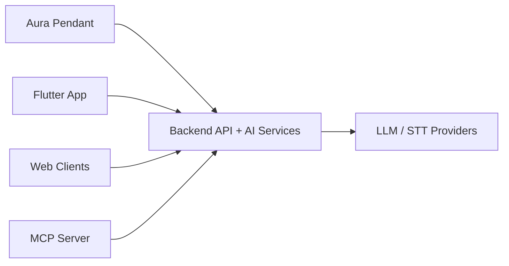

<div align="center">
  
  <h1>Aura</h1>
  <p><strong>Open-source AI wearable ecosystem.</strong></p>
  <p>Pendant firmware, backend intelligence, mobile apps, web clients, and MCP tooling.</p>

  <p>
    <a href="https://github.com/thesohamdatta/Aura/stargazers">
      
    </a>
    <a href="https://github.com/thesohamdatta/Aura/network/members">
      
    </a>
    <a href="LICENSE">
      
    </a>
    <a href="https://github.com/thesohamdatta/Aura/issues">
      
    </a>
  </p>
</div>

<p align="center">
  
</p>

<p align="center">
  <a href="#project-map">Project Map</a> |
  <a href="#quick-start">Quick Start</a> |
  <a href="#architecture">Architecture</a> |
  <a href="#contributing">Contributing</a>
</p>

## Why Aura

| Fast | Audio-First | Visual Context | Extensible |
| --- | --- | --- | --- |
| Real-time backend + web/mobile clients | Voice capture and transcript pipeline | Camera-ready pendant workflows | MCP server + SDKs for custom tooling |

## Project Map

| Component | Purpose |
| --- | --- |
| [`aura-pendant/`](aura-pendant) | Pendant software, firmware, and hardware workflow |
| [`backend/`](backend) | FastAPI services, AI pipelines, storage, integrations |
| [`app/`](app) | Flutter app (iOS, Android, desktop) |
| [`web/app/`](web/app) | Main Next.js web app |
| [`web/frontend/`](web/frontend) | Additional web client and app store UI |
| [`web/personas-open-source/`](web/personas-open-source) | Open-source personas/chat experience |
| [`mcp/`](mcp) | MCP server for memory + conversation automation |
| [`sdks/`](sdks) | SDKs for Python and React Native |

## Quick Start

<details>
<summary><b>Backend</b></summary>

```bash
cd backend
# copy .env.template to .env and add required keys
pip install -r requirements.txt
uvicorn main:app --reload --env-file .env
```

</details>

<details>
<summary><b>Flutter App</b></summary>

```bash
cd app
flutter pub get
flutter run
```

</details>

<details>
<summary><b>Web App</b></summary>

```bash
cd web/app
npm install
npm run dev
```

</details>

<details>
<summary><b>Pendant</b></summary>

```bash
cd aura-pendant
npm install
npm start
```

</details>

## Architecture



## Visuals

<p align="center">
  
  
  
</p>

## Integrations

<p align="center">
  
  
  
  
  
</p>

## Docs

- Pendant: [`aura-pendant/README.md`](aura-pendant/README.md)
- Backend: [`backend/README.md`](backend/README.md)
- MCP: [`mcp/README.md`](mcp/README.md)
- Web (frontend): [`web/frontend/README.md`](web/frontend/README.md)
- SDK (Python): [`sdks/python/README.md`](sdks/python/README.md)
- SDK (React Native): [`sdks/react-native/README.md`](sdks/react-native/README.md)

## Contributing

1. Fork this repository
2. Create a branch: `git checkout -b feat/your-change`
3. Commit your changes
4. Open a pull request

## License

MIT. See [`LICENSE`](LICENSE).

<p align="center">
  Built by <a href="https://github.com/thesohamdatta">Soham Datta</a> and open-source contributors.
</p>
