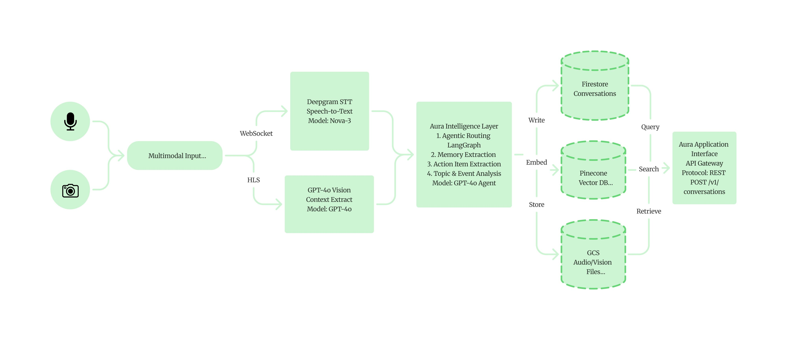

<div align="center">
  <p align="center"><code>[ SIGNAL 01 // THE BRAIN ]</code></p>
  <h1><b><font color="#E63B2E">BACKEND</font></b></h1>
</div>

<br/>

<div align="center">
  
</div>

<br/>

FastAPI backend that powers AURA's transcription, vision analysis, memory storage, and AI chat pipeline.

---

## Quick Start

1. **Install** dependencies: `pip install -r requirements.txt`
2. **Configure** keys: `copy .env.template .env`
3. **Run** server: `uvicorn main:app --reload`
4. **Tunnel** via ngrok: `ngrok http 8000`

---

## What it does

| Feature | Provider |
|:---|:---|
| STT | Deepgram |
| Vision | GPT-4o |
| Vector DB | Pinecone |
| Agent | LangGraph |

---

## Module Structure

```
backend/
├── main.py           ← entry point
├── routers/          ← API endpoints
├── database/         ← data layer
└── utils/            ← LLM & STT logic
```

<br/>

---

> **DEEP DIVE:** For Firebase setup, Firestore indexing, and API key references, visit the [Backend Setup Guide](../docs/guides/backend-setup.md).
